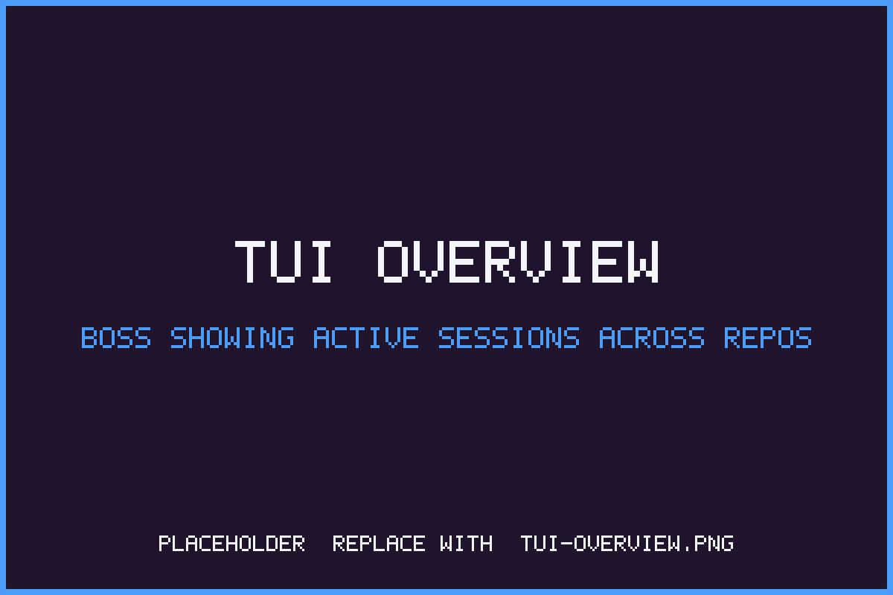

# bossanova

Manage multiple AI coding-agent sessions from one terminal.



## Install

```bash
brew install bossanova-dev/tap/bossanova
```

## Documentation

Full docs live at **[docs.bossanova.dev](https://docs.bossanova.dev)** —
quick start, configuration, plugin overview, and more.

## What You Get

- **boss** - Terminal UI for managing coding-agent sessions across repositories
- **bossd** - Background daemon handling session lifecycle and git operations

Bossd supports plugins (`bossd-plugin-*` binaries) for autonomous PR handling,
dependency updates, CI repair, and other automation. Agents run as plugins too:
`bossd-plugin-claude` owns Claude Code sessions, and `bossd-plugin-codex` owns
OpenAI Codex CLI sessions. Run `make plugins` to build all plugin binaries; the
daemon will refuse to start sessions if no agent-runner plugin is installed.

## Prerequisites

- A supported coding-agent CLI - [Claude Code](https://claude.ai/download) or
  [OpenAI Codex CLI](https://help.openai.com/en/articles/11096431-openai-codex-cli-getting-started)
  matching the runner plugin you plan to use
- [GitHub CLI](https://cli.github.com/) - Required for PR operations

## How It Works

Bossanova uses git worktrees to isolate each coding-agent session in its own directory. The daemon (bossd) manages session lifecycle, monitors PR status, and coordinates plugins. The TUI (boss) provides a unified view across all active sessions.

Sessions run in dedicated worktrees, allowing simultaneous work on multiple features without conflicts. Plugins listen for events (PR creation, CI failures, merge conflicts) and take autonomous actions.

## Setup Scripts

Each repository can have an optional setup script that runs automatically whenever a new worktree is created for a session. This is useful for installing dependencies, copying configuration files, or any other per-worktree initialization.

### Configuring

Set a setup script when adding a repo, or update it later:

```bash
boss repo update my-repo --setup-script "npm install"
```

Clear it with an empty string:

```bash
boss repo update my-repo --setup-script ""
```

### Environment Variables

The following environment variables are available to the setup script:

| Variable | Description |
|---|---|
| `REPO_DIR` | Path to the main git repository (the original clone) |
| `WORKTREE_DIR` | Path to the worktree being set up |

These let you reference files in the main repo without hardcoding paths. For example, to copy an `.env` file into each new worktree:

```bash
boss repo update my-repo --setup-script 'cp "$REPO_DIR/.env" "$WORKTREE_DIR/.env" && npm install'
```

## Configuration

Bossanova reads global settings from a JSON file on disk:

- **macOS:** `~/Library/Application Support/bossanova/settings.json`
- **Linux:** `$XDG_CONFIG_HOME/bossanova/settings.json` (defaults to `~/.config/bossanova/settings.json`)

The file is optional — when it's absent, defaults apply. Both `boss` and `bossd` read the same file.

### Example

```json
{
  "worktree_base_dir": "/Users/you/work/worktrees",
  "default_agent": "claude",
  "poll_interval_seconds": 120,
  "plugins": [
    {
      "name": "claude",
      "path": "/opt/homebrew/libexec/plugins/bossd-plugin-claude",
      "enabled": true,
      "config": {
        "dangerously_skip_permissions": "true"
      }
    },
    {
      "name": "codex",
      "path": "/opt/homebrew/libexec/plugins/bossd-plugin-codex",
      "enabled": true
    },
    {
      "name": "repair",
      "path": "/opt/homebrew/libexec/plugins/bossd-plugin-repair",
      "enabled": true
    }
  ],
  "repair": {
    "skills": { "repair": "boss-repair" },
    "cooldown_minutes": 1,
    "poll_interval_seconds": 5,
    "sweep_interval_minutes": 10
  },
  "cloud": {
    "orchestrator_url": "https://orchestrator.bossanova.dev",
    "workos_client_id": "client_01KP805YXXAMZSN2YB4NGXS9XB",
    "daemon_id": "dave-macbook"
  }
}
```

### Top-level fields

| Field | Type | Default | Description |
|---|---|---|---|
| `worktree_base_dir` | string | `~/.bossanova/worktrees` | Directory where per-session git worktrees are created. Auto-created on load. |
| `default_agent` | string | `claude` | Name of the default agent plugin used for new sessions. Set to `codex` to start Codex sessions by default. |
| `skills_declined` | bool | `false` | Legacy Claude-only decline flag from older releases. |
| `skills_declined_by_agent` | object | omitted | Per-agent skill install prompt declines, keyed by agent name (`claude`, `codex`). |
| `skills_declined_manifest_by_agent` | object | omitted | Skill payload manifest recorded when a prompt is declined; a changed manifest prompts again. |
| `skills_installed_manifest_by_agent` | object | omitted | Skill payload manifest last installed per agent. Claude skills install to `~/.claude/skills`; Codex skills install to `~/.codex/skills`. |
| `poll_interval_seconds` | int | `120` | How often the TUI polls for PR display status, in seconds. |
| `plugins` | array | auto-discovered | Plugin binaries to load (see below). If unset, `bossd` auto-discovers `bossd-plugin-*` binaries next to its own binary. |
| `repair` | object | defaults below | Repair plugin configuration. |
| `cloud` | object | defaults below | Cloud-sync settings for `bossd` and `boss login`. |

### `plugins[]` entries

| Field | Type | Description |
|---|---|---|
| `name` | string | Plugin name (matches the suffix after `bossd-plugin-`). |
| `path` | string | Absolute path to the plugin binary. |
| `enabled` | bool | When `false`, the plugin is loaded-but-inert. |
| `version` | string | Optional version string, informational. |
| `config` | object | Plugin-specific string key/value pairs. |

### `claude` plugin `config` keys

| Key | Type | Default | Description |
|---|---|---|---|
| `dangerously_skip_permissions` | string `"true"` / `"false"` | `"false"` (omit for default) | Pass `--dangerously-skip-permissions` to Claude Code. Off by default. Toggle via `boss settings --skip-permissions` / `--no-skip-permissions`, or in the boss TUI settings view. **Known gap:** the value is honored by the daemon-side tmux paths (interactive sessions, cron-spawned sessions) but is not yet forwarded into the plugin process — see the comment on `WithDangerouslySkipPermissions` in `plugins/bossd-plugin-claude/runner.go` for the design choices to wire it through. |

### `repair` fields

| Field | Type | Default | Description |
|---|---|---|---|
| `skills.repair` | string | `boss-repair` | Skill invoked to attempt repair. |
| `cooldown_minutes` | int | `1` | Minimum gap between repair attempts on the same session. |
| `poll_interval_seconds` | int | `5` | Poll interval for repair status checks. |
| `sweep_interval_minutes` | int | `10` | How often the plugin sweeps for sessions needing repair. |

### `cloud` fields

These control how `bossd` and `boss login` connect to the cloud orchestrator. All are optional; defaults target production.

| Field | Type | Default | Description |
|---|---|---|---|
| `cloud.orchestrator_url` | string | `https://orchestrator.bossanova.dev` | URL `bossd` syncs with. Set to `""` for local-only mode. |
| `cloud.workos_client_id` | string | prod WorkOS client | WorkOS client used by `boss login`. Override when pointing at a staging orchestrator. |
| `cloud.daemon_id` | string | machine hostname | Stable identifier this daemon registers under. Change it carefully — each value creates a separate daemon record on the orchestrator. |

**Note:** these fields configure the Go binaries only. The web app's WorkOS client is baked in at build time and is not affected by local `settings.json`.

**Precedence** (highest wins):

1. CLI flag (e.g. `boss --remote <url>`)
2. Environment variable (`BOSSD_ORCHESTRATOR_URL`, `BOSS_WORKOS_CLIENT_ID`, `BOSSD_DAEMON_ID`)
3. `settings.json` `cloud.*`
4. Hardcoded default

> The `cloud` block is part of an approved-but-not-yet-implemented change. Until it lands, use the matching environment variables. See the plan at `~/.claude/plans/i-have-released-to-floofy-tarjan.md`.

## Alternative Install

```bash
curl -fsSL https://bossanova.dev/install.sh | sh
```

The curl installer downloads the latest GitHub Release binaries for
macOS or Linux. It currently checks for the Claude Code CLI, GitHub CLI,
and a SHA-256 tool before installing.

## Build from Source

Requires macOS with [Homebrew](https://brew.sh/). The `make deps` target
installs everything else (`go`, `buf`, `golangci-lint`, `jq`, `gh`,
`gremlins`, and the `protoc-gen-go`/`protoc-gen-connect-go` buf plugins).

```bash
git clone https://github.com/recurser/bossanova.git
cd bossanova
make deps
make
```

Binaries land in `bin/`. The Go-based buf plugins install into `$(go env GOPATH)/bin`
(usually `~/go/bin`) — if that directory isn't on your `PATH`, `make deps` will
print the command to add it.

Other useful targets:

| Target | What it does |
|---|---|
| `make build` | Build `boss` and `bossd` only (skips plugins and cross-compiles) |
| `make plugins` | Build the `bossd-plugin-*` binaries |
| `make test` | Run tests across all modules |
| `make lint` | Run `golangci-lint` and `buf lint` |
| `make clean` | Remove `bin/` and generated code |

## Uninstall

```bash
# Stop and remove daemon
boss daemon stop
launchctl bootout gui/$(id -u) ~/Library/LaunchAgents/com.bossanova.bossd.plist
rm ~/Library/LaunchAgents/com.bossanova.bossd.plist

# Remove binaries
brew uninstall boss

# Or if installed via curl|sh:
rm /usr/local/bin/boss*
rm /usr/local/bin/bossd*

# Remove data (optional)
rm -rf ~/.boss
```
