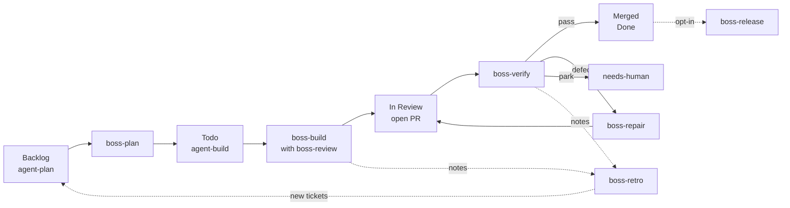

# Software Factory

The software factory is a chain of boss skills and cron jobs that takes a Linear
ticket to a merged pull request with nobody at the keyboard. You label a ticket.
The factory plans it, builds it, reviews the branch, verifies the PR and merges
it. A person steps in when the factory parks a ticket or PR and says why. A retro
stage reads what went wrong along the way and files tickets to fix it, so the
factory improves its own process.
The [in-repo factory guide](https://github.com/bossanova-dev/bossanova/blob/main/docs/skills/factory.md)
describes the same pipeline for agents and maintainers working inside a
repository.

## What it is

A ticket moves through five steps:

1. You add the `agent-plan` label to a ticket in Backlog.
2. `boss-plan` attaches a plan, swaps the label for `agent-build`, and moves the
   ticket to Todo.
3. `boss-build` implements the plan, runs `boss-review` over the branch, and opens
   a review-ready PR.
4. `boss-verify` judges the PR's current commit and merges the PR when it passes.
5. `boss-release` promotes merged work through your environments. This stage is
   opt-in.

A sixth stage runs beside the ticket flow. `boss-retro` reads what the other
stages learned and the corrections people made, and files new `agent-plan`
tickets that start again at step 1.



The factory runs on three rules:

- Verification decides the merge. A PR merges only after `boss-verify` records a
  passing verdict on its current commit, and CI and GitHub mergeability agree.
- The merge is pinned to the verified commit. A push after the verdict makes the
  merge refuse, and the new commit is verified from the start.
- Stages write unexpected outcomes down as [notes](./notes.md). `boss-retro` turns
  the ones that recur, plus the corrections people make, into tickets for the plan
  stage.

## The stages and their skills

| Stage   | Skill          | Picks up                                             | Finishes with                                        |
| ------- | -------------- | ---------------------------------------------------- | ---------------------------------------------------- |
| Plan    | `boss-plan`    | A Backlog ticket labelled `agent-plan`               | A plan on the ticket, `agent-build`, state Todo      |
| Build   | `boss-build`   | A Todo ticket labelled `agent-build`                 | A review-ready PR and `boss/build` success           |
| Verify  | `boss-verify`  | An In Review PR whose current commit needs a verdict | `boss/verify` on that commit, then a merge or a park |
| Repair  | `boss-repair`  | A PR with failing checks, conflicts or a defect      | A pushed fix, ready for verification again           |
| Release | `boss-release` | Merged commits not yet in an environment             | A release, a skip, or a park, per environment        |
| Retro   | `boss-retro`   | Notes and human corrections since its last run       | One epic of `agent-plan` tickets in Backlog          |

Every ticket scan skips tickets that carry `needs-human`.

### boss-plan

`boss-plan` picks the highest-priority Backlog ticket that has `agent-plan`. It
writes an implementation plan and attaches it to the ticket natively, then sets a
summary, an estimate and a priority. A buildable ticket leaves with `agent-build`
in Todo. A ticket that needs a decision first leaves with
`needs-human` and a comment saying why.

### boss-build and boss-review

`boss-build` picks a Todo ticket with `agent-build` whose blockers have merged. It
claims the ticket, moves it to In Progress, and implements the plan in its own
worktree. Before it publishes anything, it runs `boss-review`: specialist lenses
over the files that changed, whole-branch review rounds, and a fix for every
must-fix finding.

The run ends with a review-ready PR, a `boss/build` success status on its commit,
and the ticket in In Review. When the PR's checks settle, build hands the PR to the
verify stage.

### boss-verify

`boss-verify` judges one PR commit at a time. It runs zero-token checks first: CI on
that commit, mergeability, and the `boss/build` receipt. Then it runs any
[verify extensions](../skills/extensions.md) your repository installs. The verdict lands as a `boss/verify` status on
the commit:

- A pass merges the PR, pinned to that commit, and moves the ticket to Done.
- A defect posts the findings as a PR comment and a failure status, which hands the
  PR to repair.
- A policy problem, or a verify extension that crashed or timed out, parks the PR for
  a person.

Verify work runs inside each PR's existing session, in a chat titled `verify`, so a
tick adds no new session to your list.

### boss-repair

The repair plugin runs `boss-repair` on a PR when its checks fail, the branch
conflicts with its base, or verify reports a defect. Repair fixes the
problem, pushes, and exits, and the next verification judges the new commit. After
five attempts the plugin stops and the PR is parked for a person. Turn it off per repository in Repo Settings, as described in
[PR Lifecycle](./pr-lifecycle.md).

### boss-release

`boss-release` is opt-in. Your repository supplies a `release` extension that
performs the release, and the stage picks what to offer it. The stage reads the
merged commits not yet released, judges CI on the newest of them, and offers each
environment in order. An environment only receives commits the one before it
already has. The extension answers `released`, `skipped` or `needs-human` for each
environment. With no release extension installed, the stage reports the unreleased
changes and stops.

### boss-retro

`boss-retro` is how the factory learns from its own runs. It reads the notes the
other stages record, tagged `improvement`, and collects the corrections people made: reverted commits, comments on agent PRs, the
reasons people gave for parking work, and CI failures that repeat. It groups all of
this into themes and checks each theme against the current code, so a problem
already fixed files nothing. A theme normally needs evidence from two separate runs
before it counts.

For each theme, retro asks for the strongest fix the code allows. In order, those
are: a change that prevents the mistake, a check, a helper, a review lens, a written
rule, and context for agents. It files one epic ticket in Backlog, with one child
per theme labelled `agent-plan`, so the plan stage picks the children up like any
other ticket. Each child names the fix it wants and the prose that fix replaces. A
run files at most 15 children. Retro deletes a note only after attaching the note's
text to the ticket it fed.

Each run also checks up to five of retro's earlier tickets that are done. If the fix
landed only as prose, or has since regressed, retro files the ticket again.

To preview a run without changing notes, tickets or retro's state, run
`/boss-retro --dry-run` in a session for the repository. It prints the tickets it
would file.

### boss-epic

`boss-epic` runs a whole epic at once. Give it an epic's parent ticket and it
orders the sub-issues by their dependencies, starts parallel `boss-build` sessions,
drives repair when a child fails, merges one PR at a time, and posts progress on the
parent ticket. Use it by hand for a batch of planned tickets that belong together;
the scheduled stages keep handling everything else.

## The gates

Each stage's cron job carries a gate: a shell command the scheduler runs before
every fire. Exit `0` starts the agent session. Any other exit skips the tick, so a
tick with no work spends zero agent tokens. See
[Gate command](./cron-jobs.md#gate-command) for the exit-code contract.

| Gate    | Exits `0` when                                                             |
| ------- | -------------------------------------------------------------------------- |
| Plan    | A Backlog ticket with `agent-plan` and no `needs-human` matches            |
| Build   | A Todo ticket with `agent-build` matches and none of its blockers is open  |
| Verify  | Only when it cannot reach `boss`; it does the routing itself               |
| Release | A release extension is installed and an environment has a commit ready     |
| Retro   | Five or more new notes and corrections have arrived since retro last filed |

The verify gate does its own work instead of starting an agent, because a cron fire
always creates a new session and verify work belongs in each PR's existing session.
It finds the In Review PRs that need a verdict, runs the zero-token checks, posts or merges
what it settles mechanically, and routes the rest into each PR's `verify` chat. It
handles up to three PRs per tick and exits non-zero, so cron spawns nothing. A
`gated` row for verify in the cron list is normal.

To preview the verify sweep without writing any status, tracker change, merge or
dispatch, run its gate with `--dry-run` from the repository root:

```sh
node "$HOME/.claude/skills/boss-verify/toolbox/cron-gates/boss-verify.mjs" --dry-run
```

The dry run still reads GitHub and Linear, prints one line per PR, and always exits
`1`.

## Setup

### Prerequisites

You need:

- boss with bossd and its plugins running, and an agent runner (Claude Code or Codex);
- Node.js, and the GitHub CLI signed in to the repository's host;
- a Linear team with the labels `agent-plan`, `agent-build`, `needs-human` and
  `epic` (retro files its tickets under an `epic` parent);
- a Linear MCP server in the repository's `.mcp.json`, authenticated in your agent
  (see [Skill Configuration](../skills/config.md#declaring-the-tracker-mcp-server));
- a Linear API key on the repository in boss: open Settings (`s`), Repos (`r`), your
  repository, then **Linear**. Gates are Node scripts, and bossd hands them this key
  as `LINEAR_API_KEY`.

Install the skills, check GitHub access, and find the repository ID:

```sh
boss skills install
gh auth status
boss repo ls
```

The happy path needs no config file: the defaults expect the states Backlog, Todo,
In Progress, In Review and Done. If your Linear workspace shows more than one team,
or uses other state or label names, set them in `.boss-skills.json` as
[Skill Configuration](../skills/config.md) describes.

### Add the stage jobs

Newer boss releases ship a `boss init` that asks a few questions and creates the
plan, build and verify jobs for you; the
[in-repo factory guide](https://github.com/bossanova-dev/bossanova/blob/main/docs/skills/factory.md#set-it-up-with-boss-init)
walks through it. If `boss init --help` does not mention cron jobs, your release
predates it, so add the jobs by hand.

These commands create one disabled job per stage, so you inspect each before it
runs unattended. Leave out the release line unless your repository has a release
extension. The retro and release skills are newer than some boss releases, so add
their lines only if `boss skills install` created `boss-retro` and `boss-release`.

```sh
REPO_ID="your-repository-id"
boss cron add --repo "$REPO_ID" --name factory-plan --schedule '*/15 * * * *' --prompt '/boss-plan' --gate 'node "$HOME/.claude/skills/boss-plan/toolbox/cron-gates/boss-plan.mjs"' --enabled=false
boss cron add --repo "$REPO_ID" --name factory-build --schedule '*/15 * * * *' --prompt '/boss-build' --gate 'node "$HOME/.claude/skills/boss-build/toolbox/cron-gates/boss-build.mjs"' --enabled=false
boss cron add --repo "$REPO_ID" --name factory-verify --schedule '*/10 * * * *' --prompt '/boss-verify' --gate 'node "$HOME/.claude/skills/boss-verify/toolbox/cron-gates/boss-verify.mjs"' --enabled=false
boss cron add --repo "$REPO_ID" --name factory-release --schedule '0 * * * *' --prompt '/boss-release' --gate 'node "$HOME/.claude/skills/boss-release/toolbox/cron-gates/boss-release.mjs"' --enabled=false
boss cron add --repo "$REPO_ID" --name factory-retro --schedule '0 9 * * 1' --prompt '/boss-retro' --gate 'node "$HOME/.claude/skills/boss-retro/toolbox/cron-gates/boss-retro.mjs"' --enabled=false
boss cron ls --repo "$REPO_ID" --json
```

The first skill token in a prompt names the stage, so keep it exactly as shown.
Codex users replace `$HOME/.claude/skills` with `$HOME/.codex/skills` in the gate
paths and write the prompts as `$boss-plan`, `$boss-build`, `$boss-verify`,
`$boss-release` and `$boss-retro`. Schedules use the daemon's timezone unless you pass `--tz`. Leave
[Zero output](./cron-jobs.md#zero-output) off on every stage job: each one
needs a worktree.

Inspect a job by its ID from the list. Every cron job also shows in the TUI
(Settings, then Cron) and in the [web app](./web.md);
[Cron Jobs](./cron-jobs.md) covers both. Once a job is enabled, `run-now` fires it
straight away:

```sh
boss cron show "$JOB_ID"
boss cron run-now "$JOB_ID"
```

A manual run evaluates the gate first, so an idle stage stays idle. A disabled job's
manual run is skipped.

### Turn the stages on

In Settings, open Cron (`c`), select each job you inspected, and press Space to
enable it. An enabled job is also your consent for the stage before it to hand work
straight over. Plan fires the enabled build job as soon as it finishes a ticket,
build arranges verification when its checks settle, and verify asks for the release
job after a merge. Without an enabled job for the next stage, work waits for that
stage's own schedule. Retro hands nothing over directly: the tickets it files wait
for the plan job's next tick. Two enabled jobs for the same stage turn off the immediate
hand-off, though their scheduled ticks still run. A PR merges only through an enabled
verify job, or when you run `boss-verify` yourself.

Add `agent-plan` to a Backlog ticket to start the pipeline.

## State and visibility

### Linear labels and states

| Moment                            | State       | Label change                                     |
| --------------------------------- | ----------- | ------------------------------------------------ |
| You queue a ticket                | Backlog     | add `agent-plan`                                 |
| Planned and ready to build        | Todo        | `agent-plan` removed, `agent-build` added        |
| Build has claimed it              | In Progress | none                                             |
| PR open, waiting for verification | In Review   | none                                             |
| Verified and merged               | Done        | none                                             |
| Parked at any stage               | unchanged   | `needs-human` added                              |
| Retro files a theme               | Backlog     | parent gets `epic`, each child gets `agent-plan` |

A ticket with `needs-human` drops out of every unattended scan until someone
removes the label.

### Commit statuses

A commit status is a small record that a tool attaches to one commit. GitHub shows
it among the PR's checks, next to your CI. The factory writes two:

- `boss/build` is the build run's receipt that the commit is review-ready.
- `boss/verify` is the verdict on that commit.

A status belongs to one commit only. After a new push, the old green status no
longer counts and the new commit needs fresh evidence.

| `boss/verify` state | Description                         | Meaning                                                             |
| ------------------- | ----------------------------------- | ------------------------------------------------------------------- |
| pending             | `verifying… <token>`                | A verifier is working on this commit.                               |
| pending             | `waiting: <reason>`                 | Verification is waiting on something, such as CI.                   |
| success             | `verified` or `verified (approved)` | This commit passed. The merge still checks CI and mergeability.     |
| failure             | `defect: …`                         | Findings need repair. A `, needs human` suffix means repair parked. |
| pending             | `needs human: <reason>`             | A person has to decide.                                             |

A chat doing factory work reports its phase: planning, building, reviewing,
verifying, repairing or releasing. The session list shows the phase with a spinner
while the work runs. A PR session at rest shows one of two states read from its
current commit: verifying, with a spinner, while a verifier holds the commit, and
needs human, without one, when the PR is parked.

## Human review and approval

When the factory parks work, it adds `needs-human` to the Linear ticket and comments
there, mentioning the ticket's creator. The PR's `boss/verify` status reads
`needs human:` with the reason. A saved Linear view filtered to label `needs-human`
lists everything waiting for you, at any stage.

Read the findings, then approve the PR one of three ways:

1. Remove `needs-human` from the ticket. Verification runs again, and a parked
   defect still goes through repair and a fresh verdict.
2. Have a teammate approve the PR on GitHub. Verification accepts an approval on the
   current commit and still checks the required gates.
3. Merge the PR yourself after your own review.

GitHub does not let authors approve their own PRs, so for solo work, removing the
label is the approval path. Approval does not waive a broken required verify
extension; fix the extension.

## Filtering and extending

### Choose which tickets the factory takes

Put shared filters in `.boss-skills.json`, so the gates and the workers scan the same
tickets:

```json
{
  "trackerConfig": {
    "linear": {
      "selection": {
        "labels": { "include": ["automation"], "exclude": ["sensitive"] },
        "projects": { "include": ["Platform"] },
        "stages": { "build": { "labels": { "exclude": ["infra"] } } }
      }
    }
  }
}
```

The same block takes `assignees` and `creators`, each with `include` and `exclude`
lists; users are `me`, an ID, or an email address. A stage entry replaces only the
slot it names. An unknown label, user or project fails closed. To narrow a single
job, put the same flag on both its prompt and its gate, for example prompt
`/boss-plan --label automation` with this gate:

```sh
node "$HOME/.claude/skills/boss-plan/toolbox/cron-gates/boss-plan.mjs" --label automation
```

The flags are `--label`, `--assignee`, `--creator` and `--project`, each with an
`--exclude-` form. A ticket you name explicitly skips the filters, but unattended
scans still respect `needs-human`.

Retro reads the include labels and one include project, and puts them on the
tickets it files. It treats an exclude, assignee or creator filter in its prompt as
a usage error.

### Add your own checks and releases

The verify and release stages run repo-local extensions, discovered from
`.claude/skills/` (or `.codex/skills/`) by the `x-boss-extension` marker in each
`SKILL.md`:

```yaml
---
name: boss-verify-checks
disable-model-invocation: true
x-boss-extension:
  extends: boss-verify
  role: verify
  order: 40
---
```

A `verify` extension judges one PR commit and returns `pass` with evidence, `fail`
with findings, or `abstain`. A pass with no evidence is invalid and parks the PR. A
`release` extension declares its environments in order, for example
`environments: staging, production`, and performs the release for one environment
at a time. [Extension System](../skills/extensions.md) covers the marker and the
other roles.

### Read the notes

The stages record unexpected outcomes as notes on the repository, tagged
`improvement`. Each retro run that files deletes the notes it turned into
tickets, along with notes the code has since fixed and notes older than 30 days. List them to see what is waiting:

```sh
boss notes ls --repo "$REPO_ID"
```

[Notes](./notes.md) covers tags, search and the MCP tools.
