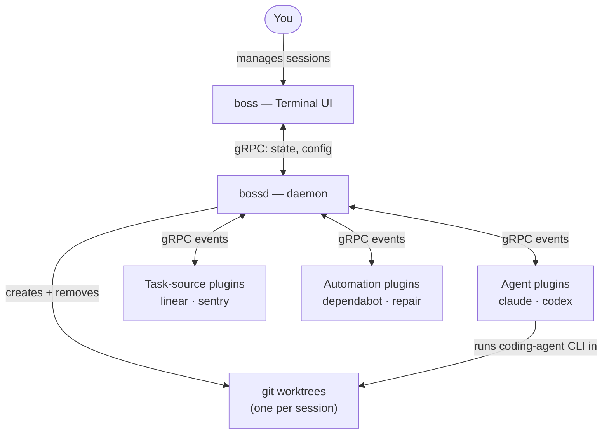

# How It Works

Bossanova uses git worktrees to isolate each agent session in its own
directory. The daemon (`bossd`) manages session lifecycle, monitors PR
status, and coordinates plugins. The Terminal UI (TUI), `boss`, provides a unified
view across all active sessions.

Sessions run in dedicated worktrees, so you work on several features at
once without conflicts. Plugins listen for events like PR
creation, CI failures, and merge conflicts, then take autonomous actions.

## Components

- **`boss`:** the TUI. Reads daemon state over gRPC and
  presents the session list, session detail, and configuration views.
- **`bossd`:** the background daemon. Owns worktree creation,
  bookkeeping, PR polling, and plugin dispatch. Communicates with `boss`
  and with plugins via gRPC.
- **Plugins (`bossd-plugin-*`):** out-of-process binaries that
  subscribe to bossd events. There are two flavors:
  - _Agent plugins_ own a coding-agent CLI subprocess for each
    session. The bundled `claude` plugin runs Claude Code, and the
    bundled `codex` plugin runs OpenAI Codex CLI. `opencode` is
    bundled too but experimental: it stays off until you opt in via
    `experimental_plugins`. The daemon needs at least one agent plugin
    loaded to start sessions.
  - _Task source plugins_ surface external issues in the new-session
    picker. `linear` (Linear tickets) and `sentry` (unresolved Sentry
    errors) are bundled and optional.
  - _Automation plugins_ react to PR events. `dependabot` and `repair`
    are bundled and optional.

## Worktree lifecycle

1. You create a session in `boss`. The daemon creates a new git worktree
   under `worktree_base_dir` (configurable; defaults to
   `~/.bossanova/worktrees`).
2. If the repository has a setup script configured, the daemon runs it
   inside the new worktree.
3. The configured agent plugin spawns its agent CLI inside the
   worktree.
4. As the agent works, the daemon watches for PR events and notifies
   plugins.
5. When you close the session, the worktree is removed.

See [Plugins](./plugins.md) for what each plugin does, and
[Skills](/skills) for the `boss-*` skill suite that automates the
ticket-to-merged-PR lifecycle on top of this machinery.
